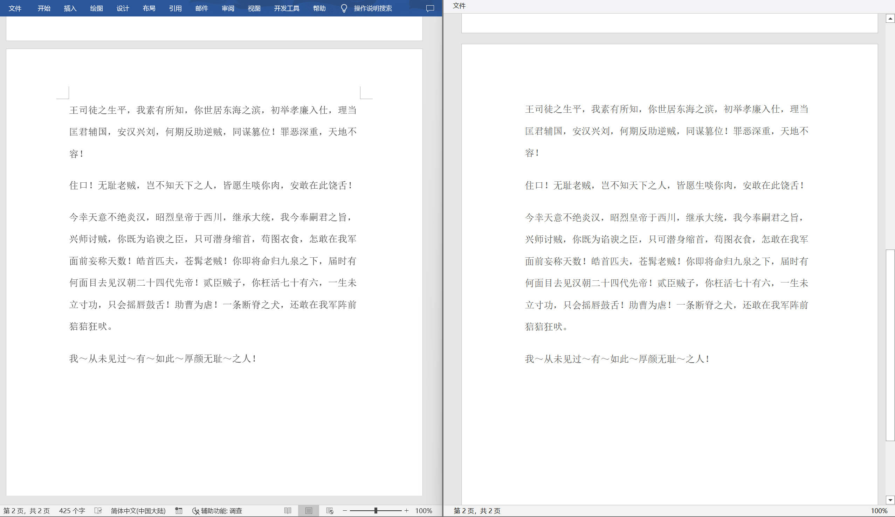

# Berry.DocxViewer

[](https://www.nuget.org/packages/Berry.DocxViewer)

一款用于浏览 Word 2007+ (.docx) 文档的 WPF 控件库，基于 [Berry.Docx.Visual](https://github.com/theyangfan/Berry.Docx/tree/main/Berry.Docx.Visual) 项目开发。

A WPF control library for browsing Word 2007+ (.docx) documents, based on the [Berry.Docx.Visual](https://github.com/theyangfan/Berry.Docx/tree/main/Berry.Docx.Visual).


本项目是参照文档在 Microsoft Office Word 2019 中的显示效果进行渲染的。由于无从得知 Word 的渲染方案，所以不保证效果与其一致。

This project is rendered with reference to how the document appears in Microsoft Office Word 2019. Since there is no way to know Word's rendering scheme, there is no guarantee that it will be consistent. 


## 程序包（Packages）

Berry.DocxViewer 的 NuGet 软件包发布在NuGet.org上:

*The release NuGet packages for Berry.DocxViewer are on NuGet.org:*

| Package          | Download                                                                                                         |
| ---------------- | ---------------------------------------------------------------------------------------------------------------- |
| Berry.DocxViewer | [](https://www.nuget.org/packages/Berry.DocxViewer) |


## 使用 (Usage)

XAML

```xml
<Window x:Class="WpfExample.MainWindow"
        xmlns="http://schemas.microsoft.com/winfx/2006/xaml/presentation"
        xmlns:x="http://schemas.microsoft.com/winfx/2006/xaml"
        xmlns:d="http://schemas.microsoft.com/expression/blend/2008"
        xmlns:mc="http://schemas.openxmlformats.org/markup-compatibility/2006"
        xmlns:local="clr-namespace:WpfExamplet"
        xmlns:berry="clr-namespace:Berry.DocxViewer;assembly=Berry.DocxViewer"
        Title="MainWindow" Height="850" Width="900">
    <Grid Name="UIGrid">
        <berry:DocxViewer Source="example.docx" />
    </Grid>
</Window>
```

C#

```c#
using Berry.DocxViewer;

DocxViewer viewer = new DocxViewer();
UIGrid.Children.Add(viewer);
viewer.Load("example.docx");
```


显示效果如下 (The display effect is as follows)：

P1


P2



40%


## 更新日志（Release History）

### v1.0.2 (2023-06-16)

- 支持表格 (Supports tables)。

### v1.0.1 (2023-06-02)

- 支持嵌入式图片 (Supports inline pictures)。

### v1.0.0 (2023-05-29)

* 支持显示页面、段落和文本字符 (Supports pages、paragraphs and characters)。
